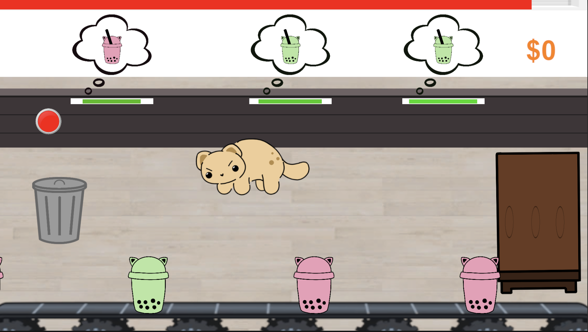
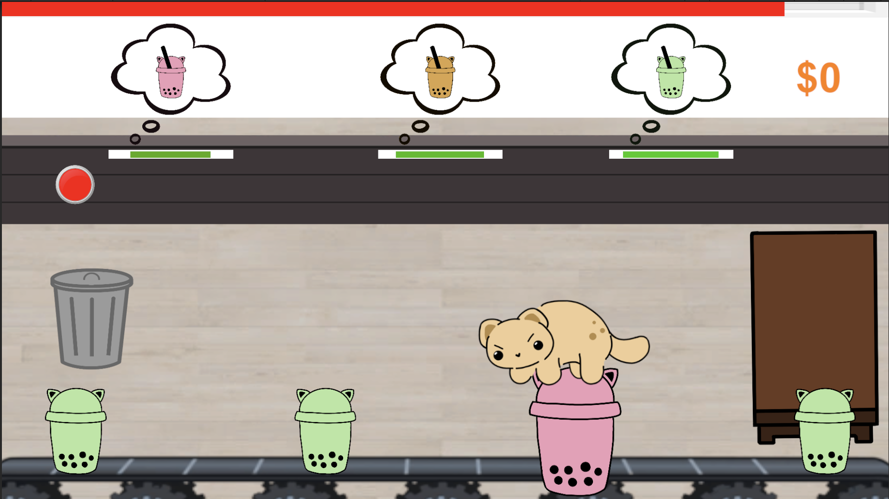
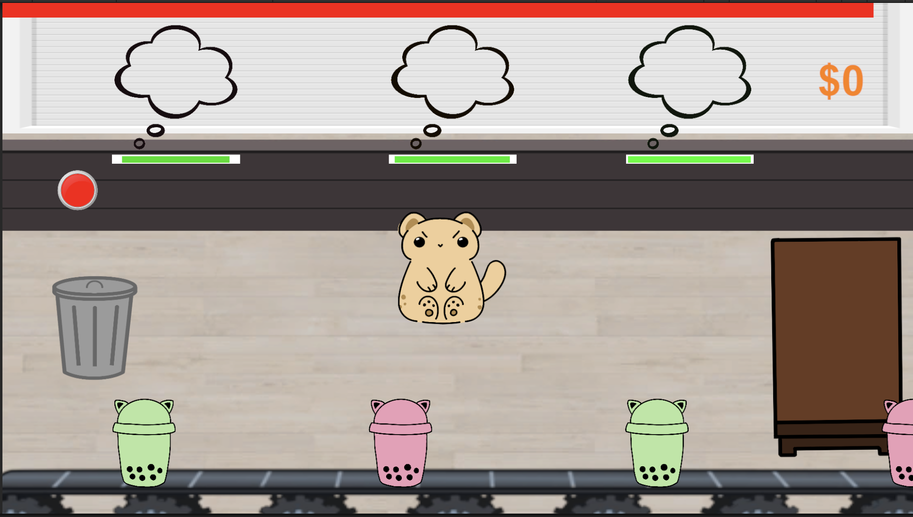
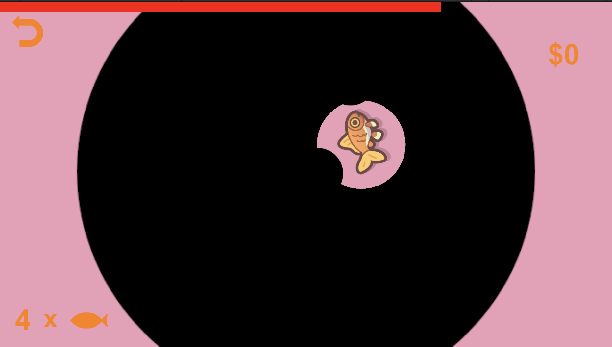
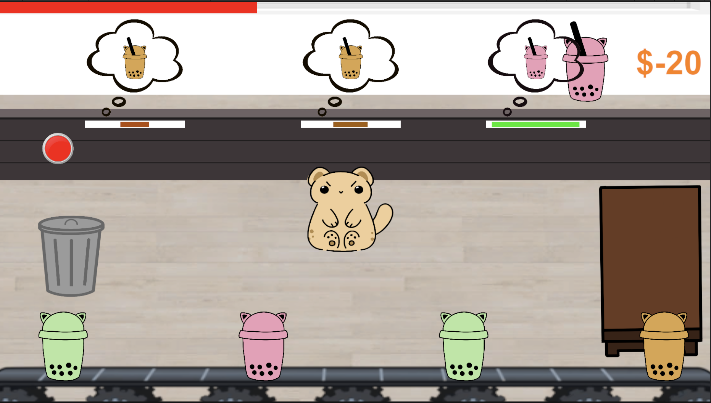
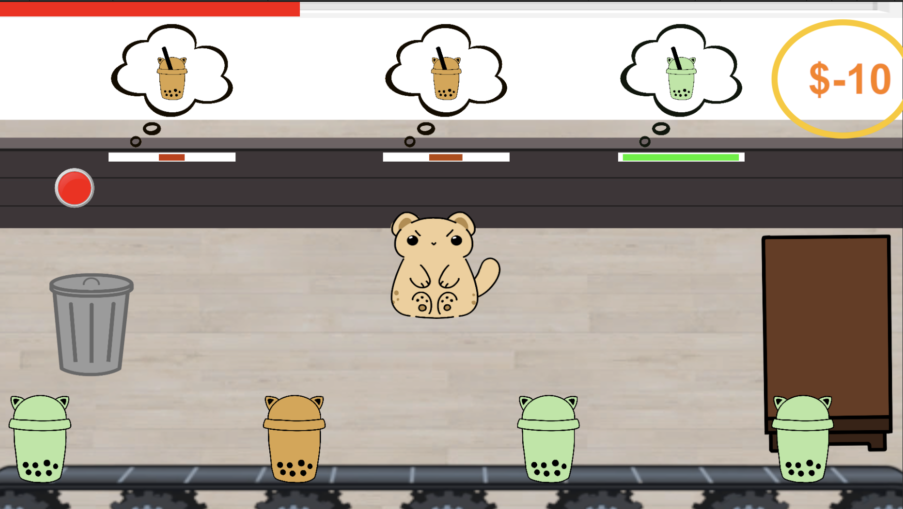
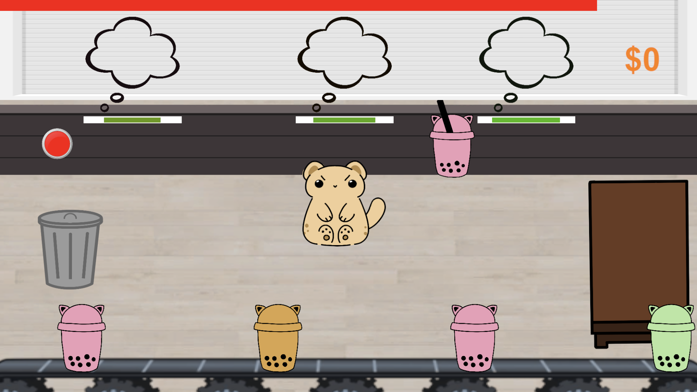
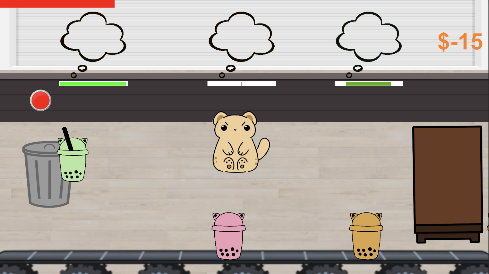

## Play now on Itch.io!
[https://carkriskai.itch.io/fishytea](https://carkriskai.itch.io/fishytea)

## Overview

In "Fishy Tea," players step into the paws of a heroic feline on a mission to rescue a boba shop from disaster. When the clumsy owner accidentally spills fish into the boba machine, the fish get packed into cups, unbeknownst to anyone. As the cat, players must use a straw to poke holes in the cups on conveyor belts and suck up the fish without the customers noticing the catastrophe, but be fast enough to serve them before they leave. With quick reflexes and strategic moves, players must prevent a fishy fiasco and save the shop's reputation. With humor and charm, "Fishy Tea" offers addictive gameplay for all ages.

## Game Demo

<iframe width="560" height="315" src="https://www.youtube.com/embed/Lztm7CF4xOU?si=606fs1I6pTSfp0h0" title="YouTube video player" frameborder="0" allow="accelerometer; autoplay; clipboard-write; encrypted-media; gyroscope; picture-in-picture; web-share" referrerpolicy="strict-origin-when-cross-origin" allowfullscreen></iframe>

## Tutorial

* Here we have a general overview of how the game works

[//]: # ()

<b>Drag the cat around  with your mouse</b>

[//]: # ()

<b>Drag cat to the boba to enter the game to suck out the fish</b>

[//]: # ()

<b>Use the red button to operate the shutters. You can't go into the cups while the shutter is open. So memorize the customers' orders then close the shutters and get the boba of the proper color</b>

(Because the customers won't like it if they see a cat sucking fish out of their boba XD).

[//]: # ()

<b>Search and click on all the fish in the drink</b>

(Remember that your customers' timers are still counting down!).

[//]: # ()

<b>Drag the de-fished boba of the proper color to its customer</b>

[//]: # ()

<b>You will lose/gain points based on your success with the orders</b>

[//]: # ()

<b>You can raise the shutters to make sure you get the right color before serving, OR put your memorization skills to the test, at your own risk!</b>

[//]: # ()

<b>Use the trashcan to get rid of accidental cups on your table</b>

## The Team

We are students making this project for our introductory game development course.

    

        <a href="https://kaileehung.github.io/" target="_blank">
            
        
<b>Kailee Hung</b>

        
ICS Senior https://kaileehung.github.io/

        </a>
    

    

        <a href="https://kristyn-mimura.github.io/" target="_blank">
            
         
<b>Kristyn Mimura</b>

        
ICS Senior https://kristyn-mimura.github.io/

        </a> 
    

    
 
        <a href="https://carolwong492.github.io/" target="_blank">
            
        
<b>Carol Wong</b>

        
ICS Senior https://carolwong492.github.io/

        </a>
    

