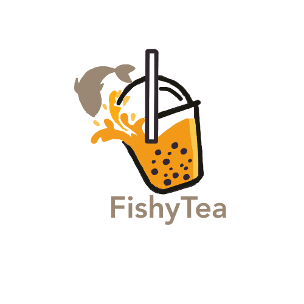

---
title: About
layout: template
filename: index
--- 

# Fishy Tea

## Overview

In "Fishy Tea," players step into the paws of a heroic feline on a mission to rescue a boba shop from disaster. When the clumsy owner accidentally spills fish into the boba machine, the fish get packed into cups, unbeknownst to anyone. As the cat, players must use a straw to poke holes in the cups on conveyor belts and suck up the fish before they reach customers. With quick reflexes and strategic moves, players must prevent a fishy fiasco and save the shop's reputation. With humor and charm, "Fishy Tea" offers addictive gameplay for all ages.

## The Team

We are students making this project for our introductory game development course.

* [Kailee Hung](https://kaileehung.github.io/), [Carol Wong](https://carolwong492.github.io/), [Kristyn Mimura](https://kristyn-mimura.github.io/)
