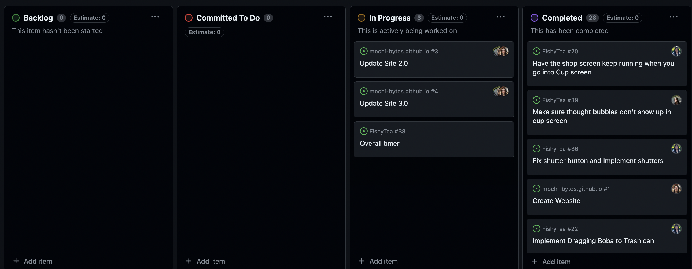

## Overview

In "Fishy Tea," players step into the paws of a heroic feline on a mission to rescue a boba shop from disaster. When the clumsy owner accidentally spills fish into the boba machine, the fish get packed into cups, unbeknownst to anyone. As the cat, players must use a straw to poke holes in the cups on conveyor belts and suck up the fish before they reach customers. With quick reflexes and strategic moves, players must prevent a fishy fiasco and save the shop's reputation. With humor and charm, "Fishy Tea" offers addictive gameplay for all ages.

## The Process

We followed an agile methodology in the development of our game, utilizing GitHub's Kanban board tool.

https://github.com/orgs/mochi-bytes/projects/1

## The Team

We are students making this project for our introductory game development course.

    

        <a href="https://kaileehung.github.io/" target="_blank">
            
        
<b>Kailee Hung</b>

        
ICS Senior https://kaileehung.github.io/

        </a>
    

    

        <a href="https://kristyn-mimura.github.io/" target="_blank">
            
         
<b>Kristyn Mimura</b>

        
ICS Senior https://kristyn-mimura.github.io/

        </a> 
    

    
 
        <a href="https://carolwong492.github.io/" target="_blank">
            
        
<b>Carol Wong</b>

        
ICS Senior https://carolwong492.github.io/

        </a>
    

