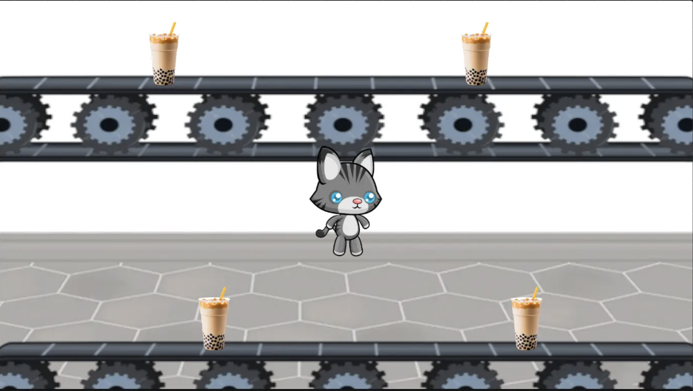
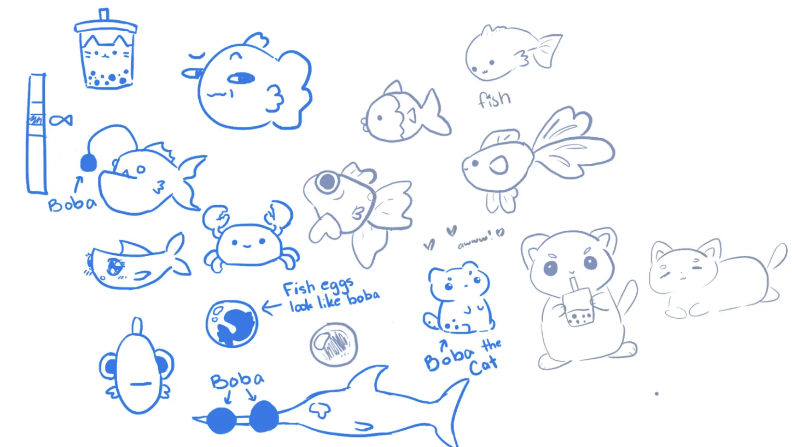

---
title: Milestone 1
layout: template
filename: milestone1
--- 

## Milestone 1

What we call our first milestone was the planning phase, including concept and gameplay ideas.

(Here, let's include our brainstorming boards and initial concept for the game (with two conveyor belts))

## Mockups

### First mockup of the random generation for boba and fish (Kailee):

[//]: # (![Mockup of the boba cup screen]&#40;<Assets/Cup Screen Mockup 1.png>&#41;)

<iframe width="350" height="230" src="https://www.youtube.com/embed/L1I021azl4Y?si=WtfJfZDbIE4jAbxF" title="YouTube video player" frameborder="0" allow="accelerometer; autoplay; clipboard-write; encrypted-media; gyroscope; picture-in-picture; web-share" referrerpolicy="strict-origin-when-cross-origin" allowfullscreen style="float: left; margin-right: 30px; margin-bottom: 30px;"></iframe>

- This is the gameplay screen where the player will have to pick out fish from the boba cup. This shows the first steps in randomly generating the boba and fish for variability.
- Proper measures were taken so that the boba and fish don't fully overlap and there is enough to fill the intended space.
- Text indicator in the top left corner of how many fish were randomly spawned so the player knows how many they need to find.

### First mockup of the shop screen (Carol):

<iframe width="350" height="230" src="https://www.youtube.com/embed/RdLDSx53n0g?si=lFt-GV0hAxFLN40s" title="YouTube video player" frameborder="0" allow="accelerometer; autoplay; clipboard-write; encrypted-media; gyroscope; picture-in-picture; web-share" referrerpolicy="strict-origin-when-cross-origin" allowfullscreen style="float: left; margin-right: 30px;"></iframe>

- Boba cups spawn from two locations: On the top and bottom of the screen. They move in opposite directions to add to the hecticness and increase the panic for the player
- The player can drag the cat to one of the boba cups. The boba cups have a visual indication that they are the one that the player is interacting with. In the future, when the player lets go of the cat on a boba cup, it will transition to the cup screen above.

### Assets for the UI and Sprites (Kristyn):
- Researched Assests and Sprites to use for the game 
- Came to the conclusion that making sprites would result in a cleaner looking game
- Found placeholder sprites
- made a logo for the game

Brainstorm sketches made with Carol
