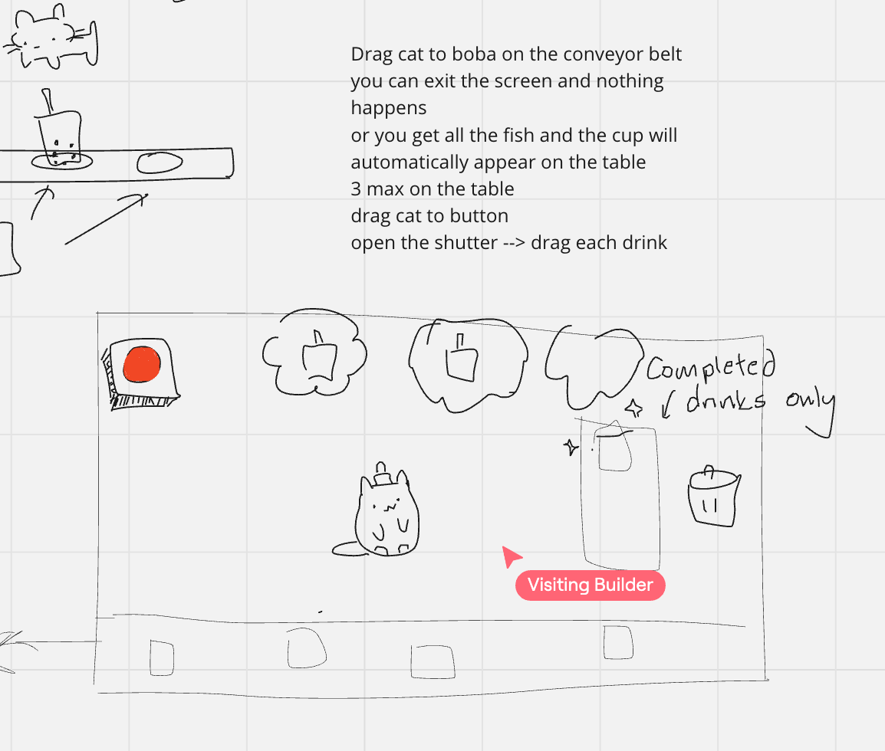
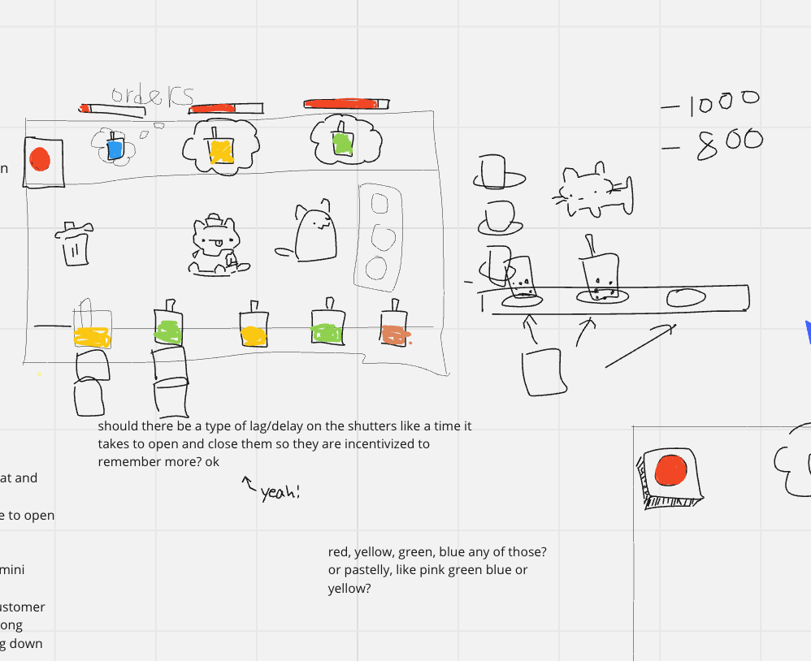

---
title: Milestone 2
layout: template
filename: milestone2
--- 

## Milestone 2

For our second milestone, after doing some rough development from milestone 1, we were able to have a better vision of the gameplay. Therefore, we made some changes to the game mechanics.

- Instead of 2 conveyor belts, there is a single conveyor belt
- Customer orders that you need to match with the correct color boba
- You either get all the fish or none. You can save 3 drinks at a time that have no fish
- A shutter that can be toggled with a button so that you can only catch the fish when the shutter is down, and you can only see and deliver the orders when the shutter is up. (In lore, this is because the customers can't see a cat sucking fish out of the boba of course!)
- Simplified score system to add and subtract money

## Progress video

<iframe width="560" height="315" src="https://www.youtube.com/embed/myoKa336WG0?si=zb7Xc-G3D-WG2Sxp" title="YouTube video player" frameborder="0" allow="accelerometer; autoplay; clipboard-write; encrypted-media; gyroscope; picture-in-picture; web-share" referrerpolicy="strict-origin-when-cross-origin" allowfullscreen></iframe>

### Cup game and spotlight (Kailee):

- Finished up implementation of the cup game so that the spotlight worked properly
- Implemented color to carrying over from the conveyor belt to the background color of the cup game

### First mockup of the shop screen (Carol):

- Implemented the customer spawner where a new customer will spawn in every 5 seconds, unless there are already 3 customers at the counter. They also each have a timer that dictates how long they will stay at the counter before being upset and leaving.
- Customer spawner 
- Customer orders have boba colors 

### Redesign and random movement of boba (Kristyn):

- ojk